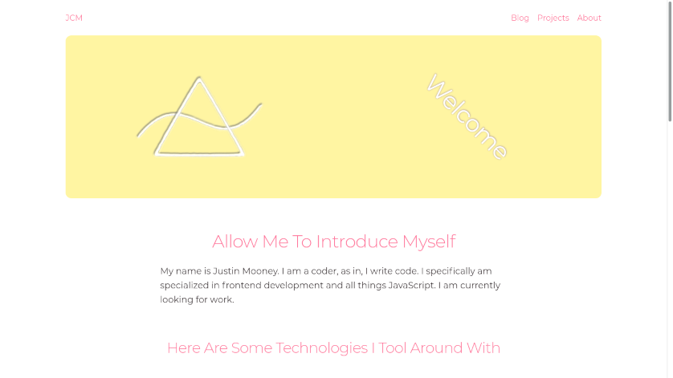

# JCM Portfolio
A portfolio showcasing Justin Mooney's software engineer work

## Setup
This project uses [gatsby-starter-blog](https://www.gatsbyjs.com/starters/gatsbyjs/gatsby-starter-blog/), and thus uses all the scripts associated with that boilerplate. The main scripts are:

### `npm run develop`
Runs the dev environment for gatsby.

### `npm run build`
Build out all the files as static assets and deploys to netlify.

